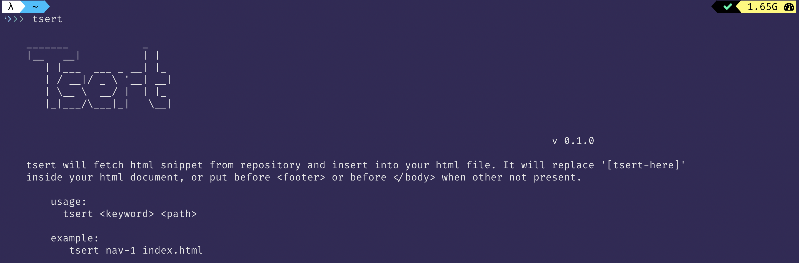

# Tsert



This is a simple CLI tool to rapidly fetch HTML snippet and put it in your code. By using this, we can fetch snippet code from github repository and insert directly into given HTML file. By put `tsert::[filename]` it will call http request, get the file and insert into your text. 

### Usage

Pattern: 
`tsert <target-file>`

Example:
 `tsert index.html`

## Example

Let say we have blank HTML document called `index.html`.

```

<!DOCTYPE html>
<html lang="en">
<head>
    <meta charset="UTF-8">
    <meta name="viewport" content="width=device-width, initial-scale=1.0">
    <meta http-equiv="X-UA-Compatible" content="ie=edge">
    <title>Document</title>
</head>
<body>
    tsert::header-1 

    <div> tsert::hero-3 </div>

    tsert::footer-2
</body>
</html>

```

Running `tsert index.html` will replace all tsert::xxx with related xxx.html fetched from the url in your config or default url from : `https://github.com/virkillz/tailstack.git`


## Installation

install globally

`npm install tsert -g`

