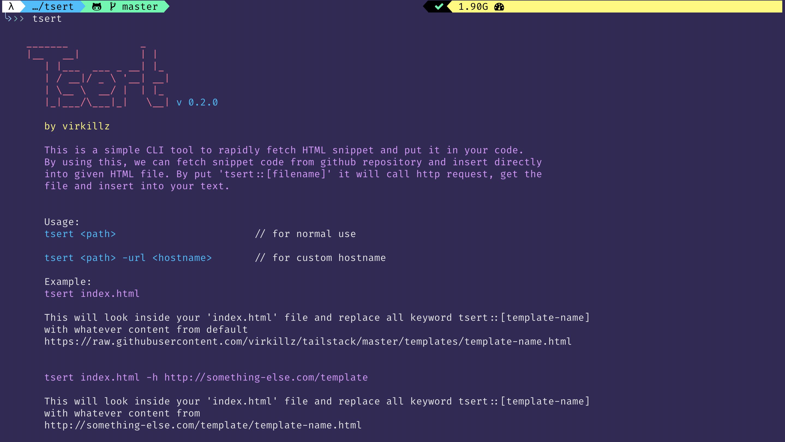

# Tsert

Tsert is a simple CLI tool you can install to help you write HTML faster. Its basically a very convenient snippet tool where you save the code in your github repo (or anywhere public), call only what you need in a quick command.




## How it worked
When you run Tsert, it looks for any text `tsert::[snippet-name]` in your document, go to the web to fetch html with the same name and replace it. By using this, we can fetch snippet code from github repository and insert directly into given HTML file. Now you can just create one repo with all your HTML snippet, and call it from anywhere.

## Design Goal
- I can just save all my HTML snippet in chunk in my github repo and call it anywhere fast, in opose to save my snippet locally or bound to my editor.
- I can only call the exact snippet I need, in opose to import all trough npm install.
- I can launch simple command in opose to go to github, open file in raw and manually copy paste to my editor.
- Anybody else can do the same and use their own repo instead by passing additional argument.


## Installation

install globally

`npm install tsert -g`


## Usage

Pattern: 
`tsert <target-file>`

Example:
 `tsert index.html`

## Example

Let say we have blank HTML document called `index.html`.

```

<!DOCTYPE html>
<html lang="en">
<head>
    <meta charset="UTF-8">
    <meta name="viewport" content="width=device-width, initial-scale=1.0">
    <meta http-equiv="X-UA-Compatible" content="ie=edge">
    <title>Document</title>
</head>
<body>
    tsert::header-1 

    <div> tsert::hero-3 </div>

    tsert::footer-2
</body>
</html>

```

Running `tsert index.html` will replace all tsert::xxx with related xxx.html fetched from the url in your config or default url from : `https://github.com/virkillz/tailstack.git`

### Wishlist

Wondering if should add option `-all` to replace all `.html` file in the same directory, and also add option `-path` to make it work at any spesific directory.
